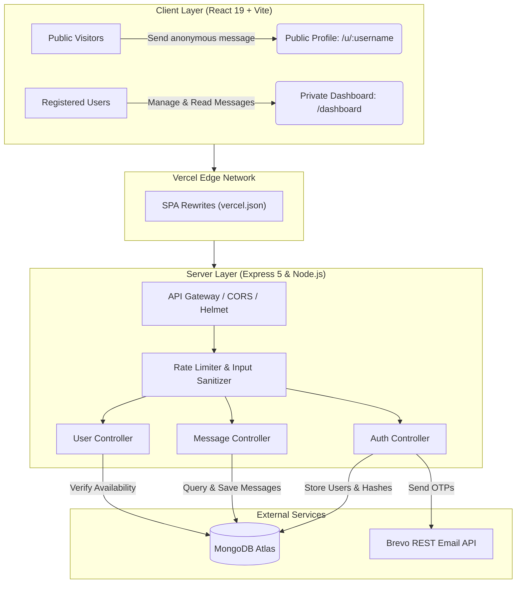

# AnonMsg — Anonymous Messaging Platform

[](https://anon-msg-delta.vercel.app)
[](https://react.dev)
[](https://tailwindcss.com)
[](https://nodejs.org)
[](https://www.mongodb.com/atlas)
[](LICENSE)

A full-stack, secure anonymous messaging web application. Users create a unique profile link, share it across social platforms (such as Instagram bio, Twitter, or WhatsApp), and receive feedback in a private, real-time dashboard.

---

## Live Application

- **Live URL:** [https://anon-msg-delta.vercel.app](https://anon-msg-delta.vercel.app)
- **Frontend Host:** [Vercel](https://vercel.com)
- **Backend Host:** Cloud Node.js API with Brevo HTTPS transactional email and MongoDB Atlas

---

## Table of Contents

- [Key Features](#key-features)
- [System Architecture](#system-architecture)
- [Tech Stack](#tech-stack)
- [Security and Architecture Highlights](#security-and-architecture-highlights)
- [Project Structure](#project-structure)
- [API Documentation](#api-documentation)
- [Getting Started Locally](#getting-started-locally)
  - [Prerequisites](#prerequisites)
  - [1. Clone Repository](#1-clone-repository)
  - [2. Backend Setup](#2-backend-setup)
  - [3. Frontend Setup](#3-frontend-setup)
- [Running Automated Tests](#running-automated-tests)
- [Deployment Guide](#deployment-guide)
- [Contributing](#contributing)
- [Author and License](#author-and-license)

---

## Key Features

- **True Anonymity**: Messages do not track, log, or associate sender IP addresses or user agents with message bodies. Senders do not need an account or authentication to submit messages.
- **Hardened Authentication**:
  - Dual-token JWT architecture with short-lived access tokens (15 minutes) and HTTP-only, secure refresh cookies (7 days).
  - Refresh token rotation with reuse detection to mitigate token theft.
  - Salted password hashing with bcrypt (10 rounds).
- **OTP Email Verification**:
  - Sign-up verification code delivered via Brevo HTTPS REST API (utilizing port 443 to avoid SMTP port restrictions on free cloud tiers).
  - Password recovery workflow via single-use 6-digit OTP codes.
- **Real-Time Username Availability**: Instant, debounced validation for claiming unique `@username` handles during registration.
- **Rate Limiting and Abuse Prevention**:
  - OTP verification brute-force protection (maximum 5 attempts per 10 minutes).
  - Authentication attempt limits (maximum 10 requests per 15 minutes).
  - Public message submission throttling (maximum 10 submissions per minute per IP).
  - Strict input sanitization middleware to guard against NoSQL injection and XSS.
- **Private Dashboard**:
  - One-click public profile link copying.
  - Master toggle switch to accept or pause incoming messages in real time.
  - Paginated message inbox with deletion confirmation modals.
- **Responsive Interface**: Minimalist UI built with Tailwind CSS v4, skeleton loaders, toast alerts, and modal dialogs.

---

## System Architecture



---

## Tech Stack

### Frontend
- **Core:** [React 19](https://react.dev/), [Vite 8](https://vite.dev/)
- **Routing:** [React Router DOM v7](https://reactrouter.com/)
- **Styling:** [Tailwind CSS v4](https://tailwindcss.com/), `@tailwindcss/vite`, `clsx`, `tailwind-merge`
- **Icons:** [Lucide React](https://lucide.dev/)
- **Forms and Validation:** [React Hook Form](https://react-hook-form.com/)
- **HTTP Client:** [Axios](https://axios-http.com/) (configured with auto-refresh token interceptor queue)

### Backend
- **Runtime:** [Node.js](https://nodejs.org/) (ES Modules)
- **Framework:** [Express 5](https://expressjs.com/)
- **Database ODM:** [Mongoose 9](https://mongoosejs.com/) (MongoDB Atlas)
- **Security:** [Helmet](https://helmetjs.github.io/), `express-rate-limit`, `cookie-parser`, `bcrypt`
- **Email Delivery:** [Brevo REST API](https://www.brevo.com/) (HTTPS Port 443)
- **Logging and Compression:** [Winston](https://github.com/winstonjs/winston), `compression`

### Testing and Tooling
- **Test Suite:** [Vitest](https://vitest.dev/), [Supertest](https://github.com/ladjs/supertest)
- **Linter:** [Oxlint](https://oxc.rs/)

---

## Security and Architecture Highlights

1. **SPA Catch-All Routing (`vercel.json`)**: Configured with URL rewrite rules ensuring direct browser refreshes on client-side routes (`/dashboard`, `/verify-otp`, `/u/:username`) are delegated to React Router instead of triggering `404: NOT_FOUND`.
2. **Silent Refresh Interceptor**: Axios interceptor catches expired `401 Unauthorized` responses and silently requests a new access token via `/auth/refresh` without session disruption or redundant requests.
3. **Brevo REST API over SMTP**: Many free cloud container hosts block outbound SMTP ports (`25`, `465`, `587`). AnonMsg delivers transactional OTPs directly over HTTPS (port `443`), guaranteeing delivery reliability.
4. **NoSQL Injection and Request Sanitization**: Strict Mongoose schema casting combined with custom request body sanitization validates all payload structures before executing queries.

---

## Project Structure

```
veno-mous/
├── backend/
│   ├── src/
│   │   ├── config/             # Database connection and environment config
│   │   ├── controllers/        # Route controllers (auth, message, user)
│   │   ├── middlewares/        # JWT auth, rate-limiters, sanitizers, error handlers
│   │   ├── models/             # Mongoose schemas (User, Message)
│   │   ├── routes/             # Express API endpoints
│   │   ├── utils/              # ApiError, ApiResponse, tokens, mailer, logger
│   │   ├── app.js              # Express app setup and middleware pipeline
│   │   └── constants.js        # Global constants (timeouts, max lengths, page sizes)
│   ├── tests/                  # Integration tests (Vitest + Supertest)
│   ├── server.js               # Server entry point
│   ├── package.json
│   └── .env.example
│
├── frontend/
│   ├── public/                 # Static assets and favicons
│   ├── src/
│   │   ├── api/                # Axios client and token refresh interceptor
│   │   ├── components/         # Reusable UI elements and ProtectedRoute
│   │   ├── context/            # AuthContext, ToastContext
│   │   ├── lib/                # Utility helpers (cn, useDebounce)
│   │   ├── pages/              # Landing, Signup, Login, OTP, Dashboard, PublicProfile, 404
│   │   ├── App.jsx             # Client route configuration
│   │   └── main.jsx            # Application mount point
│   ├── vercel.json             # Vercel SPA routing rewrite rules
│   ├── vite.config.js          # Vite and Tailwind configuration
│   ├── package.json
│   └── .env.example
│
└── README.md
```

---

## API Documentation

Base URL: `/api/v1`

### 1. Authentication (`/auth`)

| Method | Endpoint | Access | Description | Rate Limit |
|---|---|---|---|---|
| `POST` | `/auth/signup` | Public | Register new user and send OTP email | 10 req / 15 min |
| `POST` | `/auth/verify-otp` | Public | Verify 6-digit email OTP | 5 req / 10 min |
| `POST` | `/auth/resend-otp` | Public | Resend verification OTP code | 3 req / 10 min |
| `POST` | `/auth/login` | Public | Authenticate user and issue JWT tokens | 10 req / 15 min |
| `POST` | `/auth/refresh` | Public (Cookie) | Rotate and refresh access token | None |
| `POST` | `/auth/logout` | Protected | Invalidate refresh token and clear cookies | None |
| `POST` | `/auth/forgot-password`| Public | Initiate password reset OTP email | 3 req / 10 min |
| `POST` | `/auth/reset-password` | Public | Verify reset OTP and update password | 5 req / 10 min |

### 2. Messages (`/messages`)

| Method | Endpoint | Access | Description | Rate Limit |
|---|---|---|---|---|
| `POST` | `/messages/send/:username` | Public | Send anonymous message to user handle | 10 req / 1 min |
| `GET` | `/messages` | Protected | Fetch current user inbox (paginated) | None |
| `DELETE`| `/messages/:messageId` | Protected | Permanently delete a received message | None |
| `PATCH` | `/messages/toggle-accept`| Protected | Toggle accepting messages on or off | None |

### 3. Users (`/users`)

| Method | Endpoint | Access | Description | Rate Limit |
|---|---|---|---|---|
| `GET` | `/users/check-username/:username` | Public | Check if username is available | None |
| `GET` | `/users/:username` | Public | Retrieve public user profile state | None |

### 4. Health Check

| Method | Endpoint | Access | Description |
|---|---|---|---|
| `GET` | `/health` | Public | Verify server uptime (`{ success: true }`) |

---

## Getting Started Locally

### Prerequisites

- **Node.js**: v18.x or higher
- **MongoDB**: Local MongoDB instance or free cloud cluster on [MongoDB Atlas](https://www.mongodb.com/atlas)
- **Brevo API Key**: Account on [Brevo](https://www.brevo.com/) for transactional email delivery

### 1. Clone Repository

```bash
git clone https://github.com/kalpitagrawal/veno-mous.git
cd veno-mous
```

### 2. Backend Setup

```bash
cd backend

# Create your local environment file
cp .env.example .env
```

Configure your `.env` variables:

```env
PORT=5000
NODE_ENV=development
MONGODB_URI=mongodb://localhost:27017/anon-msg-app
CORS_ORIGIN=http://localhost:5173

ACCESS_TOKEN_SECRET=your_access_token_secret_here
ACCESS_TOKEN_EXPIRY=15m
REFRESH_TOKEN_SECRET=your_refresh_token_secret_here
REFRESH_TOKEN_EXPIRY=7d

# Brevo API Settings
BREVO_API_KEY=xkeysib-your_brevo_api_key
SMTP_FROM_EMAIL=your_verified_email@example.com
```

Install dependencies and start the backend development server:

```bash
npm install
npm run dev
# Server running on http://localhost:5000
```

### 3. Frontend Setup

In a separate terminal window:

```bash
cd ../frontend

# Create your local frontend environment file
echo "VITE_API_URL=http://localhost:5000/api/v1" > .env

# Install dependencies and start Vite dev server
npm install
npm run dev
# App running on http://localhost:5173
```

Visit `http://localhost:5173` in your browser.

---

## Running Automated Tests

AnonMsg includes integration tests covering route authorization, request validation, health checks, and OTP brute-force limits:

```bash
cd backend
npm test
```

To run lint checks on the frontend:

```bash
cd frontend
npm run lint
```

---

## Deployment Guide

### Deploying Frontend to Vercel
1. Push your code to GitHub.
2. In the [Vercel Dashboard](https://vercel.com), select **"New Project"**.
3. Import your repository and set the **Root Directory** to `frontend`.
4. Add the Environment Variable:
   - `VITE_API_URL`: `https://your-backend-api-url.com/api/v1`
5. Click **Deploy**. The included [`frontend/vercel.json`](frontend/vercel.json) handles all SPA client-side routes automatically.

### Deploying Backend to Render or Railway
1. Create a new **Web Service** pointing to your repository.
2. Set the Root Directory to `backend`.
3. Build Command: `npm install`
4. Start Command: `node server.js`
5. Configure production environment variables:
   - `MONGODB_URI`
   - `ACCESS_TOKEN_SECRET`
   - `REFRESH_TOKEN_SECRET`
   - `CORS_ORIGIN`: `https://anon-msg-delta.vercel.app`
   - `BREVO_API_KEY`
   - `SMTP_FROM_EMAIL`

---

## Contributing

1. Fork the repository
2. Create a feature branch (`git checkout -b feature/improvement`)
3. Commit your changes (`git commit -m 'feat: add improvement'`)
4. Push to the branch (`git push origin feature/improvement`)
5. Open a Pull Request

---

## Author and License

**Kalpit Agrawal**
- GitHub: [@kalpitagrawal](https://github.com/kalpitagrawal)
- Repository: [veno-mous](https://github.com/kalpitagrawal/veno-mous)

This project is licensed under the **ISC License**.
